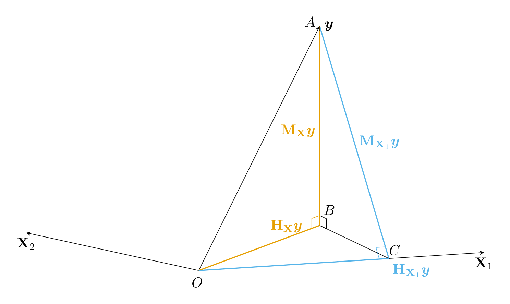
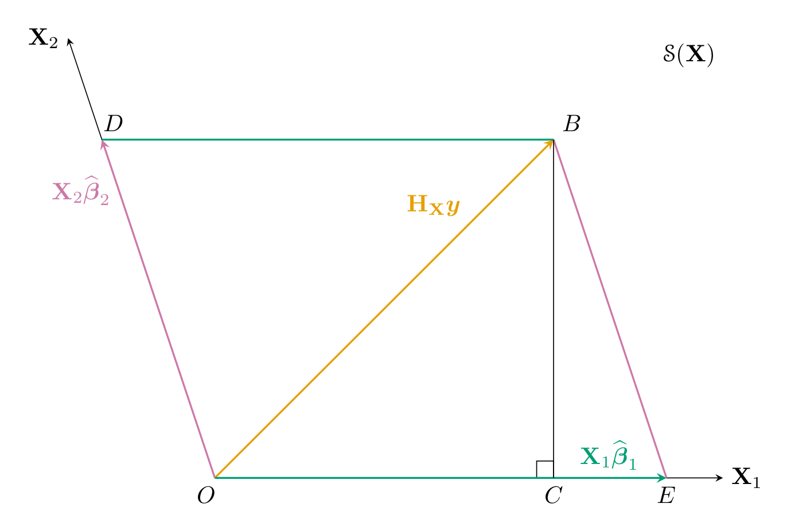
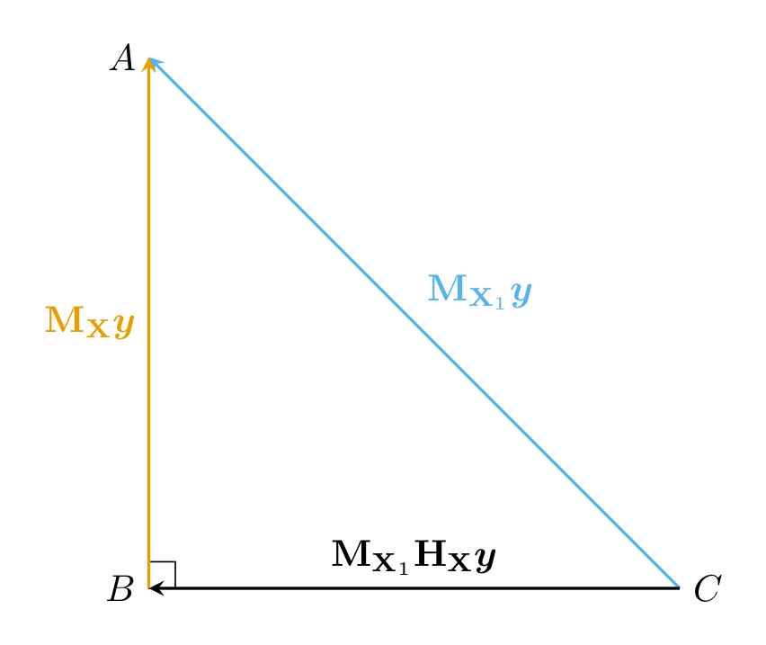

# Frisch--Waugh--Lovell theorem

This result dates back to the work of [Frisch, R. and F. Waugh (1933)](https://www.jstor.org/stable/1907330) and of [M. Lovell (1963)](https://doi.org/10.1080/01621459.1963.10480682). The FWL theorem has two components: it gives a formula for partitioned OLS estimates and shows that residuals from sequential regressions are identical.

Consider the following linear regression 
$$
 \by = \bX_1\bbeta_1+\bX_2\bbeta_2+ \bs{u}, \label{eq1}
$$
where the response vector $\by$ is $n \times 1$, the vector of errors $\bs{u}$ is a realization from a mean zero random 
variable. The $n \times p$ full-rank design matrix $\bX$ can be written as the partitioned 
matrix $(\bX_1^\top, \bX_2^\top)^\top$ with blocks $\bX_1$, an $n \times p_1$ matrix, and $\bX_2$, an $n \times p_2$ matrix. Let 
$\hbb_1$ 
and $\hbb_2$ be the ordinary 
least square (OLS) parameter estimates from running this regression. Define the orthogonal projection matrix $\Hmat_\bX$ as usual and 
$\Hmat_{\bX_i} = 
\bX_i^{\vphantom{\top}}(\bX_i^\top\bX_i^{\vphantom{\top}})^{-1}\bX_i^\top$ for $i=1, 2$. Similarly, 
define the complementary projection matrices $\Mmat_{\bX_1}=\mathbf{I}_n-\Hmat_{\bX_1}$ and $\Mmat_{\bX_2}=\mathbf{I}_n-\Hmat_{\bX_2}$.

```{theorem}
The ordinary least square estimates of $\bbeta_2$ and the residuals from \eqref{eq1} are identical to those obtained by 
running the regression 
$$
 \Mmat_{\bX_1}\by = \Mmat_{\bX_1}\bX_2\bbeta_2 + \text{residuals}. \label{eq2} \
$$
```

```{proof}
The easiest proof uses projection matrices, but we demonstrate the result for OLS coefficients directly.
Consider an invertible $d \times d$ matrix $\mathbf{C}$ and denote its inverse by $\mathbf{D}$; then
$$
\begin{pmatrix} \mathbf{C}_{11} & \mathbf{C}_{12} \\ \mathbf{C}_{21} &\mathbf{C}_{22}
\end{pmatrix}\begin{pmatrix} \mathbf{D}_{11} & \mathbf{D}_{12} \\ \mathbf{D}_{21} &\mathbf{D}_{22}
\end{pmatrix}
=\mathbf{I}_p
$$
gives the relationships
\begin{align*}
\mathbf{C}_{11}\mathbf{D}_{11}+\mathbf{C}_{12}\mathbf{D}_{21} &= \mathbf{I}_{p_1}\\
\mathbf{C}_{11}\mathbf{D}_{12}+\mathbf{C}_{12}\mathbf{D}_{22} &= \mathbf{O}_{p_1, p_2}\\
\mathbf{C}_{22}\mathbf{D}_{21}+\mathbf{C}_{21}\mathbf{D}_{11} &= \mathbf{O}_{p_2, p_1}\\
\mathbf{C}_{22}\mathbf{D}_{22}+\mathbf{C}_{21}\mathbf{D}_{12} &= \mathbf{I}_{p_2}\\
\end{align*}
from which we deduce that the so-called Schur complement of $\mathbf{C}_{22}$ is $$\mathbf{C}_{11}+\mathbf{C}_{12}\mathbf{C}^{-1}_{22}\mathbf{C}_{21} = \mathbf{D}_{11}^{-1}$$
and 
$$
-\mathbf{C}_{22}\mathbf{C}_{21}(\mathbf{C}_{11}+\mathbf{C}_{12}\mathbf{C}^{-1}_{22}\mathbf{C}_{21})^{-1} = \mathbf{D}_{21}.
$$
Substituting 
$$
\begin{pmatrix} \mathbf{C}_{11} & \mathbf{C}_{12} \\ \mathbf{C}_{21} &\mathbf{C}_{22}
\end{pmatrix} \equiv \begin{pmatrix} \mathbf{X}_1^\top\mathbf{X}_1 & \mathbf{X}_1^\top\mathbf{X}_2\\\mathbf{X}_2^\top\mathbf{X}_1  &\mathbf{X}_2^\top\mathbf{X}_2 
\end{pmatrix}
$$
and plug-in this result back in the equation for the least squares yields
\begin{align*}
\hat{\boldsymbol{\beta}}_1 &= (\mathbf{D}_{11}\mathbf{X}_1^\top + \mathbf{D}_{12}\mathbf{X}_2^\top)\boldsymbol{y} 
\\&= \mathbf{D}_{11}( \mathbf{X}_1^\top - \mathbf{C}_{12}\mathbf{C}_{22}^{-1}\mathbf{X}_2)\boldsymbol{y}
\\&= \left(\mathbf{C}_{11}+\mathbf{C}_{12}\mathbf{C}^{-1}_{22}\mathbf{C}_{21}\right)^{-1} \mathbf{X}_1^\top\mathbf{M}_{\mathbf{X}_2}\boldsymbol{y} 
\\&= (\mathbf{X}_1^\top\mathbf{M}_{\mathbf{X}_2}\mathbf{X}_1)^{-1}\mathbf{X}_1^\top\mathbf{M}_{\mathbf{X}_2}\boldsymbol{y}.
\end{align*}

The proof that the residuals are the same is left as an exercise.
```

## Geometric proof using pictures

The Frisch--Waugh--Lovell theorem is perhaps best explained using pictures. Davidson and McKinnon (1993) ``Estimation and Inference in Econometrics'' monograph offers a fantastic illustration (Fig 1.7), which is reproduced below for convenience. The explanation is my own.


Consider for simplicity the bivariate case and two non-parallel vectors $\mathbf{X}_1$ and $\mathbf{X}_2$. The yellow line illustrate the usual orthogonal decomposition $\bs{y} = \Hmat_{\mX}\by + \Mmat_{\mX}\by$, where $\Hmat_{\mX}\by$ is the segment $OB$ and $\Mmat_{\mX}\by$ is the segment $BA$. A similar decomposition can be performed in terms of the sole $\mX_1$, namely through $\Hmat_{\mX_1}\by$ corresponding to the line segment $OC$ and
$\Mmat_{\mX_1}\by$ corresponding to $CA$.

```{r fwl1, out.width = "85%", fig.cap = "Orthogonal decomposition into residuals and fitted values", echo = FALSE,fig.align = 'center'}

```

We may also look at the projection onto $\Sp(\mX)$ of the vector $\by$ and its fitted value. More specifically, consider the decomposition $\Hmat_{\mX}\by = \mX_1\hbb_1 + \mX_2\hbb_2$. This is represented by the parallelogram $ODBE$; the segments $OD$ and $EB$ correspond to the vector $\mX_2\hbb_2$, while $DB$ and $OE$ are shifted copies of $\mX_1\hbb_1$. 

```{r fwl2,  fig.cap = "Projection onto spane spanned by the regressors", echo = FALSE,fig.align = 'center'}

```

The right-angled triangle $ABC$ is orthogonal to $\mX_1$. We deduce that the segment $CB$ is $\Mmat_{\mX_1}\Hmat_{\mX}\by$. 

```{r fwl3, fig.cap="Triangle ABC", echo = FALSE,fig.align = 'center'}

```


We can deduce from Figure \@ref(fig:fwl3) the formula for least squares since $\Mmat_{\mX_1}\Hmat_{\mX}\by = \Mmat_{\mX_1}\mX_2\hbb_2$. It is now hopefully clear that $BA$ is the vector $\boldsymbol{e}$ of residuals from the original regression. 


